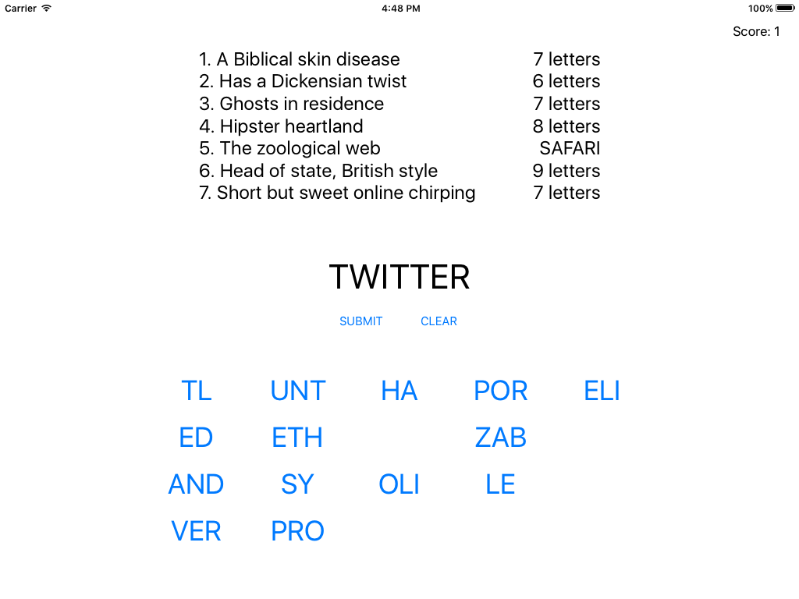

# 7SwiftyWords
Repo following Project 8 tutorial on www.hackingwithswift.com building a word-guessing game that provides player with clues and answer strings are divided into 2-3 word chunks.



## Concepts Learned/Practiced
* Using ```enumerate()``` method on an array to return both the item and the index
  * Example from project:
    ```swift
    for (index, line) in lines.enumerate() {
      let parts = line.componentsSeparatedByString(": ")
      let answer = parts[0]
      let clue = parts[1]

      clueString += "\(index + 1). \(clue)\n"

      //code continues on...
    }
    ```  
* Property observers
  * Example from project:

    ```
      var score: Int = 0 {
        didSet {
          scoreLabel.text = "Score: \(score)"
      }
    }
    ```

* ```.addTarget()``` method
  * The code equivalent of Ctrl-dragging in Xcode storyboards to add an action.
* More use of ```pathForResource()``` method and ```String```'s ```contentsOfFile``` which was previously introduced in the Word Scramble game.
* Using GameplayKit again for randomizing array order
* String methods:
  * ```stringByReplacingOccurrencesOfString()```
  * ```componentsSeparatedByString()```
  * ```stringByTrimmingCharactersInSet()```
  * ```joinWithSeparator()``` makes an array into a single string where each array element is separated by string specified in its parameter
* Half-open Range operator within for-in loop
  * Goes through range only but does not include upper limit value
  * Example from project:

    ```
      for i in 0..<letterBits.count {
        //do stuff here...
      }
    ```

* Modulo operator ```%```

## Attributions
[Project 5 Tutorial: 7 Swifty Words @ hackingwithswift.com](https://www.hackingwithswift.com/read/8/overview)
